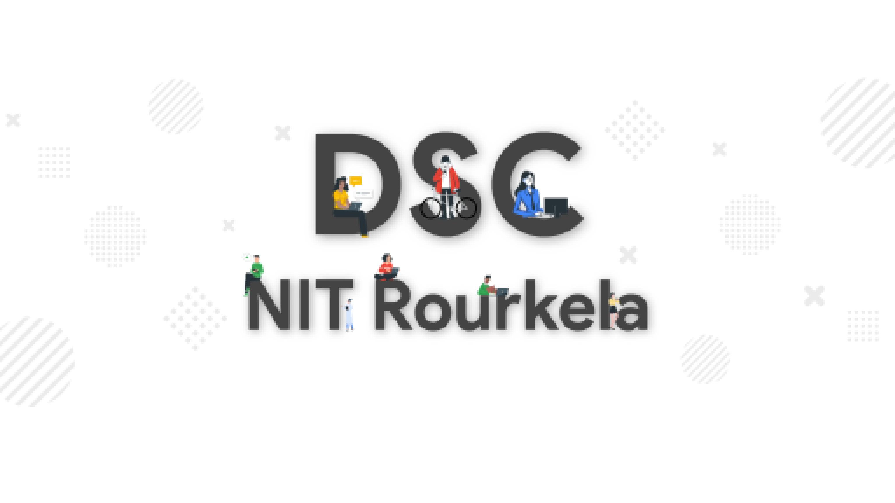

[](https://github.com/zepfietje/starware)

# project-elaichi

[](https://codecov.io/gh/dscnitrourkela/project-elaichi)


## DSC NIT Rourkela
Project developed and maintained by [DSC NIT Rourkela](https://dscnitrourkela.org/)


## Description

This is the development repository for campus guide at NIT Rourkela.

## 🚀 Installation Guide

1.  **Install Flutter on your machine**

    Install flutter by selecting the operating system on which you are installing Flutter:

    [Flutter installation tutorial](https://flutter.dev/docs/get-started/install)

    To check if you have flutter installed along wtih proper necesarry SDKs installed
    run `flutter doctor`

2.  **Clone the Repo**

    To clone this repository, run `git clone https://github.com/developer-student-clubs-nitr/project-elaichi.git`
    Then run `cd project-elaichi`

3.  **Get Packages**
    Make sure you are in the `project-elaichi/elaichi` directory

    - From the terminal: Run `flutter pub get`.
      _OR_
    - From Android Studio/IntelliJ: **Click Packages get** in the action ribbon at the top of `pubspec.yaml`.
    - From VS Code: **Click Get Packages** located in right side of the action ribbon at the top of `pubspec.yaml`.

4.  **Test the App**

    Make sure you are in the `project-elaichi/elaichi` directory.

    #### Run the App

    On terminal:

    - Check that an Android device is running by running `flutter devices`. If none are shown, follow the device-specific instructions on the [Install](https://flutter.dev/docs/get-started/install) page for your OS.
    - Run the app with the following command:

    ```
    flutter run
    ```

Congrats 🥳 ! You just ran the _Project Elaichi_ App.
Feel free to use the app in whatever way possible and make sure to send us feedbacks and suggest changes.

## Contributing 
------------
Our Slack Community: [Slack Invite](http://bit.ly/NITRDevs) <br>

`Contributions are welcome 🎉🎉`

Please refer to the project's style and contribution guidelines for submitting patches and additions. In general, we follow the "fork-and-pull" Git workflow.

 1. **Fork** the repo on GitHub
 2. **Clone** the project to your own machine
 3. **Commit** changes to your own branch
 4. **Push** your work back up to your fork
 5. Submit a **Pull request** so that we can review your changes

NOTE 1: Please abide by the [Contributing Guidelines](./CONTRIBUTING.md).

NOTE 2: Please abide by the [Code of Conduct](./CODE_OF_CONDUCT.md).


## Starware

This is Starware.  
This means you're free to use the project, as long as you star its GitHub repository.  
Your appreciation makes us grow and glow up. ⭐

## Project Structure

- data - Manages the API and Local data
- domain - Manages the business logic of the application
- presentation - Manages the UI, routing and blocs
<!-- * di - Manages the dependency Injection of the application -->

<!-- ## Code of Conduct

This project adheres to the Contributor Covenant code of conduct. By participating, you are expected to uphold this code. Please report unacceptable behavior to info@flutter.pt. -->

<!-- ## License
This project is open source software licensed under the [MIT LICENSE](LICENSE.md).-->

## Contributing

We are open to suggestions, bug-reporting and features! We would love to see you contribute but make sure you follow our [Contributing Guidelines](CONTRIBUTING.md).
