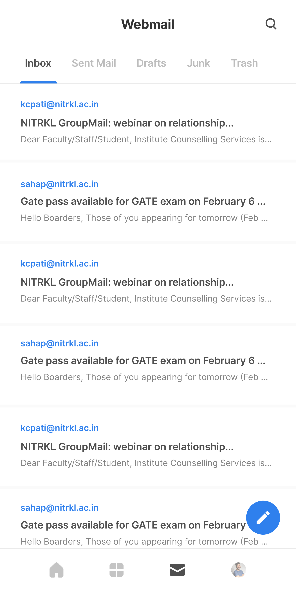

  

<h1 align="center">Project Elaichi</h1>

[![Contributors][contributors-shield]][contributors-url]
[![Forks][forks-shield]][forks-url]
[![Stargazers][stars-shield]][stars-url]
[![Issues][issues-shield]][issues-url]
[![MIT License][license-shield]][license-url]

Project developed and maintained by [Google Developer Students Club, NIT Rourkela](https://dscnitrourkela.org/)

## Description

This is the development repository for campus guide at NIT Rourkela. It is an mobile application for the students of NIT Rourkela for easing their stay at the college. It has a variety of features like:

- **Campus Guide**: It provides the list of all the events in the campus at any point of time.
- **Campus News Updates**: It provides the latest Monday Morning Articles about the campus for all lines of interest.
- **Zimbra Mail**: You can access your zimbra mail account from the app without the hassle of logging in to the zimbra server everytime.
- **Central Time Tabe**: It provides the time table of the students of NIT Rourkela, decoded and accessible with ease.

  
  
  
  
  

## Contributing

------------
Our Slack Community: [Slack Invite](http://bit.ly/NITRDevs)

`Contributions are welcome 🎉🎉`

Please refer to the project's style and contribution guidelines for submitting patches and additions. In general, we follow the "fork-and-pull" Git workflow.

 1. **Fork** the repo on GitHub
 2. **Clone** the project to your own machine
 3. **Commit** changes to your own branch
 4. **Push** your work back up to your fork
 5. Submit a **Pull request** so that we can review your changes

NOTE 1: Please abide by the [Contributing Guidelines](./CONTRIBUTING.md).

NOTE 2: Please abide by the [Code of Conduct](./CODE_OF_CONDUCT.md).

NOTE 3: For setting up the project in your local system, please refer to the [Elaichi Setup Instructions](./elaichi/README.md) and [Dalchini Setup Instructions](./dalchini/README.md).

We are open to suggestions, bug-reporting and features! We would love to see you contribute but make sure you follow our [Contributing Guidelines](CONTRIBUTING.md).

## Starware

This is Starware.  
This means you're free to use the project, as long as you star its GitHub repository.  
Your appreciation makes us grow and glow up. ⭐

<!-- * di - Manages the dependency Injection of the application -->

<!-- ## Code of Conduct

This project adheres to the Contributor Covenant code of conduct. By participating, you are expected to uphold this code. Please report unacceptable behavior to info@flutter.pt. -->

<!-- ## License
This project is open source software licensed under the [MIT LICENSE](LICENSE.md).-->

<!-- MARKDOWN LINKS & IMAGES -->
<!-- https://www.markdownguide.org/basic-syntax/#reference-style-links -->

[contributors-shield]: https://img.shields.io/github/contributors/dscnitrourkela/project-elaichi?style=for-the-badge
[contributors-url]: https://github.com/dscnitrourkela/project-elaichi/graphs/contributors
[forks-shield]: https://img.shields.io/github/forks/dscnitrourkela/project-elaichi?style=for-the-badge
[forks-url]: https://github.com/dscnitrourkela/project-elaichi/network/members
[stars-shield]: https://img.shields.io/github/stars/dscnitrourkela/project-elaichi?style=for-the-badge
[stars-url]: https://github.com/dscnitrourkela/project-elaichi/stargazers
[issues-shield]: https://img.shields.io/github/issues/dscnitrourkela/project-elaichi?style=for-the-badge
[issues-url]: https://github.com/dscnitrourkela/project-elaichi/issues
[license-shield]: https://img.shields.io/github/license/dscnitrourkela/project-elaichi?style=for-the-badge
[license-url]: https://github.com/dscnitrourkela/project-elaichi/blob/main/LICENSE
